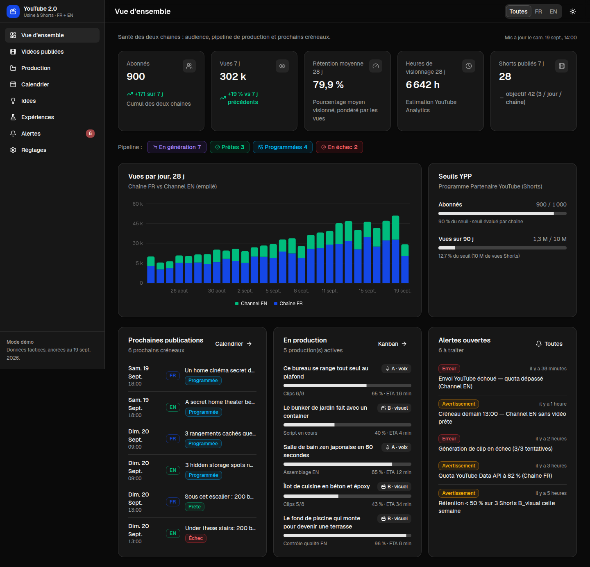

# YouTube Aura Farming

Une usine à **YouTube Shorts** qui tourne sur ton PC : l'IA trouve les idées, écrit le script, dessine chaque scène,
l'anime, ajoute la voix, la musique et les sous-titres, puis monte la vidéo et la publie sur **YouTube Shorts** et sur
**TikTok**. Tu pilotes tout depuis un tableau de bord qui s'ouvre dans ton navigateur.

> **Tu veux juste l'installer et t'en servir ?** Lis seulement « Installation facile » ci-dessous : 3 étapes, 2 fichiers
> à double-cliquer. Le reste de la page est la documentation technique.

## Installation facile (Windows)

### Ce qu'il te faut

| | |
|---|---|
| Système | Windows 10 ou 11 |
| Carte graphique | **NVIDIA RTX avec 8 Go de mémoire vidéo ou plus** : c'est elle qui fabrique les images et les vidéos |
| Mémoire vive | 32 Go conseillés |
| Disque | **60 Go libres sur C:** |
| Internet | environ 45 Go à télécharger, une seule fois (1 à 3 heures selon la connexion) |
| Compte Google | pour la clé Gemini, gratuite |

Rien d'autre à installer à la main, pas même Python : l'installeur s'en charge.

### Étape 1 : télécharger le projet

1. Sur cette page GitHub, clique sur le bouton vert **Code**, puis sur **Download ZIP**.
2. Clic droit sur le fichier ZIP téléchargé > **Extraire tout…** > choisis le **Bureau** > **Extraire**.
3. Ouvre le dossier extrait (et le dossier du même nom qui se trouve dedans) : tu dois voir `INSTALLER.bat` et `LANCER.bat`.

### Étape 2 : installer (une seule fois)

1. **Double-clique sur `INSTALLER.bat`.**
   Si Windows affiche « Windows a protégé votre ordinateur », clique sur **Informations complémentaires** puis
   **Exécuter quand même** (ou sur **Exécuter** si c'est une autre fenêtre de sécurité).
2. Suis ce qui s'affiche dans la fenêtre noire. L'installeur :
   - te demande ta **clé API Gemini** (voir juste en dessous) ;
   - installe les logiciels qui manquent (Node.js, uv, FFmpeg, Docker Desktop, 7-Zip) : **clique sur « Oui »** chaque
     fois que Windows demande l'autorisation ;
   - télécharge ComfyUI et les modèles d'IA (environ 45 Go) : c'est la partie longue, tu peux faire autre chose ;
   - prépare la base de données avec Docker.
3. À la fin, il affiche **« Installation terminée ! »** et crée un raccourci **YouTube Aura Farming** sur le Bureau.

La fenêtre s'est arrêtée avant la fin (coupure d'internet, redémarrage demandé…) ? **Relance `INSTALLER.bat`** : il
reprend où il s'était arrêté, sans tout retélécharger.

#### La clé API Gemini (gratuite, 2 minutes)

C'est l'IA de Google qui trouve les idées et écrit les scripts.

1. Va sur **https://aistudio.google.com/apikey** (l'installeur ouvre la page tout seul) et connecte-toi avec ton compte
   Google.
2. Clique sur **Create API key** (« Créer une clé API »), puis **copie** la clé : elle commence par `AIza`.
3. Dans la fenêtre de l'installeur, fais un **clic droit** pour la coller, puis appuie sur **Entrée**.

Pour la changer plus tard : dans l'appli, **Réglages > Intelligence artificielle**.

#### Docker Desktop, la première fois

Docker fait tourner la base de données de l'appli. Quand il s'ouvre pour la première fois :

- clique sur **Accept** (conditions d'utilisation) ;
- s'il propose de créer un compte ou de se connecter : **Skip** (ou « Continue without signing in ») ;
- s'il demande de **redémarrer l'ordinateur** ou de **mettre à jour WSL** : accepte, puis relance `INSTALLER.bat`.

### Étape 3 : lancer (à chaque fois)

**Double-clique sur le raccourci « YouTube Aura Farming » du Bureau** (ou sur `LANCER.bat`). Il démarre tout et ouvre
l'appli dans ton navigateur, à l'adresse **http://localhost:3000**.

Trois fenêtres réduites apparaissent dans la barre des tâches (ComfyUI, Worker, Dashboard) : ce sont les moteurs,
**laisse-les ouvertes**. Pour tout arrêter, ferme-les. La fenêtre du lanceur, elle, peut se fermer.

### Comment ça marche

1. **Création** : choisis un thème ; l'IA propose des idées de vidéos. ✓ = on la fabrique, ✗ = on passe.
2. L'IA écrit le script et dessine une image par scène (le *storyboard*), en quelques minutes.
3. Regarde le storyboard, puis clique sur **Valider et fabriquer** : clips vidéo, voix, musique et montage se font tout
   seuls (30 minutes à 1 heure par vidéo).
4. **Bibliothèque** : les vidéos terminées, à regarder et à télécharger. Le bouton **Tâches**, en haut, montre ce qui
   est en cours. Les fichiers sont aussi dans `C:\YouTube2\data\videos`.
5. **Publication** : chaque Short programmé sur YouTube part aussi sur TikTok, à la même heure, si tu as relié un
   compte TikTok (voir « Pour aller plus loin »).

Thèmes prêts avec l'installation de base : maisons de rêve, histoires vraies (Wikipédia), animaux étranges, chantiers en
accéléré, visites de luxe. Les « histoires de karma » demandent des modèles en plus ([`docs/35`](docs/35-recette-drame.md)).

### Si ça coince

| Ce que tu vois | Quoi faire |
|---|---|
| « Windows a protégé votre ordinateur » | **Informations complémentaires** > **Exécuter quand même** |
| « Le dossier du projet est incomplet » | Le fichier a été lancé depuis le ZIP : fais d'abord **Extraire tout** (étape 1) |
| Un logiciel ne s'installe pas tout seul | Installe-le avec le lien du tableau ci-dessous, puis relance `INSTALLER.bat` |
| « Docker ne répond pas » | Redémarre l'ordinateur, ouvre **Docker Desktop**, attends « Engine running », relance le fichier |
| « Pas assez de place sur le disque C: » | Libère de la place (Paramètres > Système > Stockage), puis relance `INSTALLER.bat` |
| Pas d'idées, pas de script | Clé Gemini absente ou refusée : **Réglages > Intelligence artificielle** |
| Gemini répond « quota » ou « high demand » | Dans **Réglages > Intelligence artificielle**, choisis un autre modèle (une version « flash-lite », par exemple) |
| La fenêtre ComfyUI parle de CUDA ou de pilote | Mets à jour le pilote NVIDIA (version 580 ou plus) : https://www.nvidia.com/fr-fr/drivers/ |
| L'appli ne s'ouvre pas | Attends une minute et va sur http://localhost:3000 ; sinon ouvre la fenêtre « Dashboard » et lis le message |

### Liens de téléchargement (si l'installation automatique d'un logiciel échoue)

| Logiciel | À quoi il sert | Lien |
|---|---|---|
| Node.js (version LTS) | fait tourner le tableau de bord | https://nodejs.org/fr/download |
| uv | installe Python et le moteur de l'appli | https://docs.astral.sh/uv/getting-started/installation/ |
| FFmpeg | monte les vidéos | https://www.gyan.dev/ffmpeg/builds/ |
| Docker Desktop | fait tourner la base de données | https://www.docker.com/products/docker-desktop/ |
| 7-Zip | décompresse ComfyUI | https://www.7-zip.org/ |
| Pilote NVIDIA | carte graphique à jour | https://www.nvidia.com/fr-fr/drivers/ |
| winget (« Programme d'installation d'application ») | installe tout le reste automatiquement | https://apps.microsoft.com/detail/9NBLGGH4NNS1 |

FFmpeg et uv s'installent plus simplement en tapant, dans le **Terminal** (menu Démarrer > Terminal),
`winget install Gyan.FFmpeg` puis `winget install astral-sh.uv`.

### Pour aller plus loin

- **Publier automatiquement sur YouTube** : Réglages > Chaînes. Il faut des identifiants Google Cloud, demande à Luca
  ([`docs/05-youtube-api.md`](docs/05-youtube-api.md)). En attendant, télécharge la vidéo depuis la Bibliothèque et
  publie-la toi-même sur YouTube Studio.
- **Publier aussi sur TikTok** (gratuit pour 2 comptes) : crée un compte sur [zernio.com](https://zernio.com), connecte-y
  ton compte TikTok, crée une clé API, puis colle-la dans **Réglages > TikTok**. Choisis ton compte TikTok en face de ta
  chaîne et coche **Automatique** : chaque Short programmé sur YouTube sort aussi sur TikTok, à la même heure. Les
  vidéos déjà sorties se publient une par une depuis la Bibliothèque (**Publier sur TikTok**). Tout le détail :
  [`docs/36-publication-tiktok.md`](docs/36-publication-tiktok.md).
- **Nouvelle version du projet** : retélécharge le ZIP, extrais-le, relance `INSTALLER.bat`. C'est rapide : tes réglages
  et tout ce qui est déjà téléchargé restent dans `C:\YouTube2`.
- **Tout désinstaller** : supprime le dossier du projet et `C:\YouTube2`, puis, si tu veux, Docker Desktop, Node.js,
  uv, FFmpeg et 7-Zip (Paramètres > Applications).

Ce que font les deux fichiers, pour les curieux : [`installation/installer.ps1`](installation/installer.ps1) et
[`installation/lancer.ps1`](installation/lancer.ps1).

---

# YouTube 2.0 (documentation technique)

Fabrique automatisée de **YouTube Shorts** organisée en séries de contenu (maisons de rêve et passages secrets,
histoires vraies tirées de Wikipédia, animaux étranges, chantiers en accéléré, visites de luxe…), publiés sur une ou
plusieurs chaînes (une chaîne de test pour commencer, d'autres s'ajoutent depuis Réglages) et sur TikTok par Zernio,
générés par IA en local, avec un dashboard de pilotage.

| Dossier | Contenu |
|---|---|
| [`docs/`](docs/) | Architecture, modèle de données, pipeline, dashboard, API YouTube, stack locale, roadmap, ADR |
| [`supabase/migrations/`](supabase/migrations/) | Schéma Postgres (Supabase) : jobs, productions, vidéos, métriques, RLS |
| [`apps/dashboard/`](apps/dashboard/) | Dashboard Next.js 16 + shadcn/ui (vue d'ensemble, création, bibliothèque, calendrier, réglages, panneau des tâches) |
| [`services/worker/`](services/worker/) | Worker Python local : agents LLM (Claude, Mistral, Gemini, Ollama en secours), ComfyUI, Kokoro, FFmpeg, upload et Analytics YouTube, publication TikTok (Zernio), benchmark vidéo |
| [`launcher/`](launcher/) | Lanceur Windows `.bat` + fiche mémo (dossier Projets_Code-start) |



## Lire en premier
1. [`docs/01-architecture.md`](docs/01-architecture.md) : les trois plans (dashboard, Supabase, PC), les principes.
2. [`docs/09-agents-et-automatisation.md`](docs/09-agents-et-automatisation.md) : **révision de la chaîne d'agents**, route image → vidéo, portes humaines, par où commencer.
   Mise en œuvre : [`docs/11-sous-titres-seo-strategie-storyboard.md`](docs/11-sous-titres-seo-strategie-storyboard.md)
   (sous-titres personnalisables, agents SEO et stratégie, storyboard et workflows Wan 2.2, commande `yt2`).
   Étude de l'option « vidéos virales expliquées » : [`docs/10-etude-option-videos-virales.md`](docs/10-etude-option-videos-virales.md).
   **Séries de contenu** (Wikipédia, animaux, maisons, Minecraft), règles du storytelling addictif, continuité des
   clips, premiers rendus sur la RTX 3070 : [`docs/12-series-de-contenu-et-storytelling.md`](docs/12-series-de-contenu-et-storytelling.md).
   **Dashboard branché** (réglages IA et clés depuis l'écran Réglages, démarrer / voir / programmer depuis Idées et
   Production) : [`docs/13-dashboard-reglages-et-production.md`](docs/13-dashboard-reglages-et-production.md).
   **Refonte du dashboard** (Création : chaîne → thème → idées ✓ / ✗ ; Bibliothèque de toutes les vidéos ;
   panneau des tâches avec arrêt ; chaînes multiples et import de leur historique) :
   [`docs/16-creation-bibliotheque-taches.md`](docs/16-creation-bibliotheque-taches.md).
   **Deux formats visuels sans voix** (chantiers en accéléré, visites de maisons de luxe : images clés retouchées en
   chaîne, clips première + dernière image, titre d'accroche façon MJClipIt, bruitages, musique générée) :
   [`docs/15-formats-timelapse-et-visites.md`](docs/15-formats-timelapse-et-visites.md).
   **Gemini en ligne** (bouton ✦ Gemini à côté de « Valider et fabriquer » : les clips sont fabriqués par l'appli
   Gemini de l'abonnement Google AI Pro, pilotée dans un Chrome dédié ; ≈ 8 clips d'affilée puis quelques heures d'attente) :
   [`docs/17-gemini-en-ligne.md`](docs/17-gemini-en-ligne.md), [`ADR-008`](docs/decisions/ADR-008-gemini-en-ligne.md).
   **Favoris** (étoile sur un storyboard : idée, script et images gardés même s'il est abandonné ; menu Favoris pour
   les revoir et les refaire avec ces images ou de nouvelles) : [`docs/19-favoris.md`](docs/19-favoris.md).
   **Onglet Agents** (chaque agent, son prompt système modifiable et versionné, les consignes communes, et la chaîne
   de production complète en direct, de l'idée à la publication) : [`docs/22-agents.md`](docs/22-agents.md).
   **Onglet Montage** (aperçu 9:16 où placer et styliser titre d'accroche, sous-titres et textes à l'écran, polices
   ajoutables, rendu exact par le worker ; le modèle choisi sert à tous les montages, « Refaire le montage » pour une
   vidéo à valider) : [`docs/23-montage.md`](docs/23-montage.md).
   **Récits qui posent un enjeu** (le scénariste relit les pages sources entières, un relecteur juge le fond, modèle
   d'écriture plus fort) et **scène carte** (vue de l'espace, zoom satellite, tracé du lieu) :
   [`docs/24-recits-enjeu-carte-musique.md`](docs/24-recits-enjeu-carte-musique.md).
   **Dashboard des statistiques** (toutes les vidéos publiées dans un tableau triable et des graphiques : vues,
   rétention, audience à 3 s, j'aime, partages, abonnés ; compteurs relevés chaque heure, bouton Actualiser) et **agent
   analyste** (compare les vidéos qui marchent et les autres, en regardant leurs images, et propose des leçons que les
   agents reçoivent une fois validées) : [`docs/25-dashboard-statistiques.md`](docs/25-dashboard-statistiques.md).
   **Musiques de fond** (les pistes de Luca du dossier `music`, décrites et choisies selon l'ambiance de chaque
   histoire, égalisées puis réglées dans l'onglet Montage → Son avec écoute sous une vraie voix ; la musique de chaque
   vidéo est gardée pour les statistiques) : [`docs/26-musique.md`](docs/26-musique.md).
   **Réinventer une scène du storyboard** (une scène hors sujet est réécrite par le scénariste : autre plan, narration
   raccord avec les scènes voisines, nouvelles images) : [`docs/27-reinventer-une-scene.md`](docs/27-reinventer-une-scene.md).
   **Bibliothèque complète** (les vidéos en fabrication avec leurs clips déjà faits, et un onglet « Démos et essais »
   pour regarder ou supprimer les vidéos faites hors de l'appli) : [`docs/30-bibliotheque-complete.md`](docs/30-bibliotheque-complete.md).
   **Mail « vidéo terminée »** (un mail avec l'image et le lien de la vidéo dès qu'elle est montée et contrôlée ;
   adresse, compte Gmail qui envoie et mail d'essai dans Réglages → Notifications) :
   [`docs/32-notifications-mail.md`](docs/32-notifications-mail.md).
   **Nombres en chiffres à l'écran** (sous-titres, titre d'accroche et textes à l'écran : « 852 morts », jamais
   « huit cent cinquante-deux » ; la voix les lit toujours en toutes lettres) :
   [`docs/33-nombres-en-chiffres.md`](docs/33-nombres-en-chiffres.md).
   **Retoucher une vidéo** (Bibliothèque → fiche → « Retoucher » : corriger à la main, pour cette vidéo seulement, le
   titre d'accroche, les sous-titres, la musique, le mixage et la voix, puis la refaire) :
   [`docs/34-retouche.md`](docs/34-retouche.md).
   **Drame en dialogues** (recette « drama » : histoires de karma jouées par des fruits, des humains ou des animaux ;
   une fiche par personnage donnée en référence à chaque plan, une réplique par plan dite par une voix de personnage,
   trois thèmes dans Création) : [`docs/35-recette-drame.md`](docs/35-recette-drame.md).
   **Publication sur TikTok** (par l'API de Zernio, dont l'appli TikTok est validée : chaque Short programmé sur
   YouTube sort aussi sur TikTok à la même heure ; clé et compte dans Réglages → TikTok, état et lien dans la
   Bibliothèque ; pourquoi ni l'API officielle, ni Make, ni un robot de navigateur) :
   [`docs/36-publication-tiktok.md`](docs/36-publication-tiktok.md).
3. [`docs/03-pipeline.md`](docs/03-pipeline.md) : les étapes, le planificateur, les agents.
4. [`docs/05-youtube-api.md`](docs/05-youtube-api.md) : OAuth, quotas, **audit de conformité à lancer tout de suite**.
5. [`docs/08-benchmark-video.md`](docs/08-benchmark-video.md) : génération vidéo gratuite, locale et en ligne, recommandation.
   Mise à jour du 2026-09-25 (Qwen-Image 2.1, LTX-2.5, Blender + Higgsfield, journée de production) et **règle de
   gratuité** : [`docs/14-modeles-de-generation-et-gratuite.md`](docs/14-modeles-de-generation-et-gratuite.md),
   [`ADR-007`](docs/decisions/ADR-007-gratuite.md). Leviers de qualité vidéo sans changer de moteur (interpolation,
   agrandissement SeedVR2, prompts de mouvement, nouveaux modèles de 2026) : [`docs/20-qualite-video.md`](docs/20-qualite-video.md).
   Meilleurs modèles pour la RTX 3070, licences ignorées en phase de test (MiniMax H3 élagué, vision locale, les
   tendances Hugging Face modèle par modèle) : [`docs/21-modeles-hugging-face-8go.md`](docs/21-modeles-hugging-face-8go.md).
   **Banc d'essai des voix** (les 18 voix installées sur une vraie narration : temps par Short et par semaine, mots mal
   compris mesurés par Whisper, et les modèles de voix à installer ensuite) : [`docs/29-banc-voix.md`](docs/29-banc-voix.md).
   **Santé de la machine** (bloc « Machine » de la barre latérale : RAM, ComfyUI, worker, bouton « Redémarrer » ;
   relance automatique de ComfyUI) : [`docs/28-sante-machine.md`](docs/28-sante-machine.md).
   **Niche « histoires de karma »** (dix vidéos TikTok de fruits et d'humains en animation 3D analysées : ressorts,
   rétention, format ; thème « Le Karma des Fruits », six scripts complets et ce qu'il manque à l'app pour les
   fabriquer) : [`docs/31-niche-histoires-karma.md`](docs/31-niche-histoires-karma.md).
6. [`docs/07-roadmap.md`](docs/07-roadmap.md) : phases et prérequis manuels.

## Démarrage rapide (tout en local, ADR-006)

Windows : double-cliquer `launcher/youtube-shorts-daily - demarrer.bat` (après avoir adapté `ROOT` et créé
les deux fichiers `.env`). Il lance ComfyUI, le worker et le dashboard, puis ouvre le navigateur.

À la main :

```bash
# Dashboard (données factices, sans backend)
cd apps/dashboard
npm install
NEXT_PUBLIC_MOCK=1 npm run dev        # http://localhost:3000

# Base de données : coller supabase/migrations/0001_init.sql puis supabase/seed.sql
# dans l'éditeur SQL du projet Supabase (ou `supabase db push`)

# Worker (sur le PC avec le GPU)
cd services/worker
cp ../../.env.example .env             # remplir DATABASE_URL, clés LLM, fournisseurs
uv sync --extra tts && uv run worker
```

## Dépôt
`https://github.com/100sluca/youtube-shorts-daily`, branche `main`. Le projet a été conçu dans le dépôt
Logements100s (branche `claude/youtube-2-0-architecture-tud7zx`, dossier `youtube-2.0/`) puis extrait ici
avec son historique ; cette branche d'origine peut être supprimée.
