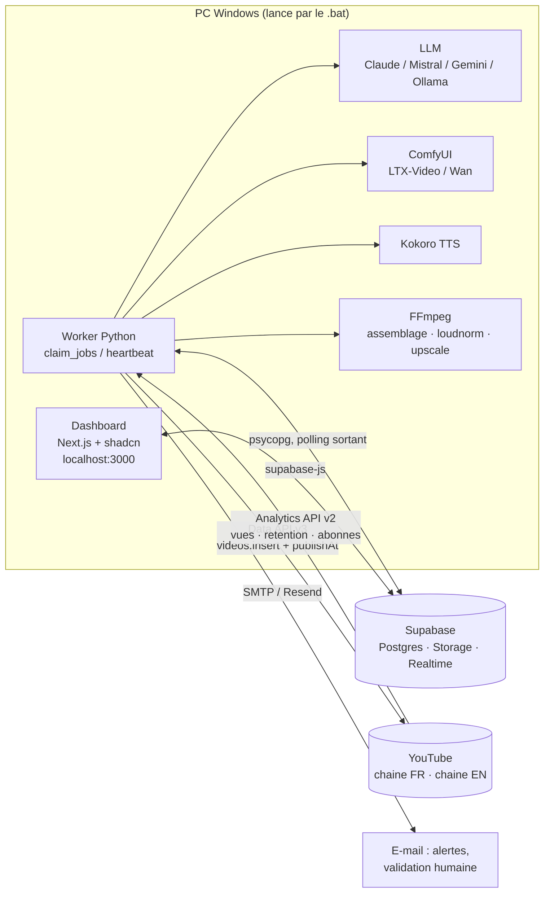

# 01 · Architecture générale

> Objectif : produire et publier automatiquement 3 Shorts / jour / chaîne (FR + EN),
> générés par IA en local, avec un dashboard pour piloter la fabrique de bout en bout.

## 1. Vue d'ensemble

Tout tourne sur le PC (ADR-006), la base de données est hébergée chez Supabase (offre gratuite) :

| Plan | Où | Rôle |
|---|---|---|
| **Dashboard** | PC, `npm run dev` port 3000 (Next.js 16 + shadcn/ui) ; hébergement Vercel / Cloudflare plus tard | Pilotage : idées, production, calendrier, métriques, réglages. |
| **Contrôle** | Supabase (Postgres, Storage, Realtime) | Source de vérité : file de jobs, vidéos, métriques, prompts, alertes. |
| **Fabrique** | PC, worker Python (GPU 8 Go) | Agents LLM, ComfyUI (vidéo), Kokoro (TTS), FFmpeg (montage), upload YouTube, synchro Analytics. |



Principes :

1. **Rien n'écoute sur Internet.** Le worker et le dashboard font uniquement des appels sortants
   (Supabase, YouTube, LLM). Aucun port à ouvrir, aucune infra à maintenir.
2. **YouTube gère la publication.** Les vidéos sont uploadées en `private` avec un `publishAt`.
   Si le PC est éteint au moment du créneau, la vidéo sort quand même. Le worker maintient
   un tampon (buffer) de 2 à 3 jours de vidéos déjà programmées.
3. **100 % automatique par défaut, validation humaine en option.** `channels.auto_publish`
   (interrupteur dans Réglages) : à `false`, chaque vidéo passe en « Contrôle / revue » et un
   e-mail est envoyé à `adresse@example.com` ; à `true`, elle est programmée dès la QA.
4. **Un master visuel, deux rendus.** Une *production* génère les clips une seule fois ; une
   *vidéo* par chaîne y ajoute narration, textes et métadonnées localisés (ADR-002).
5. **Tout passe par la file de jobs.** Chaque étape est un job avec progression 0-100, tentatives
   et journal. Le dashboard s'y abonne en temps réel : c'est la vue « avancement des vidéos ».
6. **Fournisseurs interchangeables, avec secours.** LLM : Claude puis Mistral, Gemini, Ollama
   (chaîne `LLM_FALLBACKS`). Vidéo et TTS derrière des interfaces (ADR-005), benchmark dans
   `08-benchmark-video.md`.
7. **Les fichiers lourds restent sur le PC.** Seuls un aperçu 480p et un poster montent dans
   Supabase Storage pour le dashboard ; le fichier final part directement vers YouTube.

## 2. Flux d'une vidéo (résumé)

```mermaid
sequenceDiagram
  autonumber
  participant P as Planificateur (worker)
  participant Q as jobs (Postgres)
  participant W as Worker
  participant Y as YouTube
  participant D as Dashboard

  P->>Q: ideate (si backlog < 10 idées)
  D->>Q: approuve un concept → production + job script
  W->>Q: claim script → écrit productions.script (scènes, narration FR/EN, métadonnées)
  W->>Q: crée generate_clip ×N (1 par scène), tts ×2, assemble ×2, qa ×2
  W->>W: ComfyUI → clips → Storage (preview) / disque (master)
  W->>W: Kokoro → narration FR / EN
  W->>W: FFmpeg → final 1080×1920 par chaîne, loudnorm, boucle
  W->>Q: qa → durée, loudness, résolution → ready (auto) ou review + e-mail
  D->>Q: validation humaine (si activée) → ready ; créneau via next_free_slot
  W->>Y: upload private + publishAt → status scheduled
  Y-->>Y: publication au créneau
  W->>Y: sync_metrics (quotidien) → vues, rétention, abonnés, commentaires
  D->>D: dashboard : métriques, A/B, courbes de rétention
```

## 3. Stack technique

**Dashboard** (`apps/dashboard`)
- Next.js 16 (App Router, Server Components), TypeScript strict, Tailwind v4, shadcn/ui.
- Recharts via le wrapper `chart` de shadcn ; TanStack Table pour la liste des vidéos.
- Données : couche `src/lib/data` (mock déterministe ou Supabase). `DASHBOARD_AUTH=none` en
  local (pas de login) ; `supabase` + `app_users` + RLS quand il sera hébergé.

**Contrôle** (`supabase/`)
- Postgres : schéma dans `migrations/0001_init.sql` (types, tables, vues, RLS, fonctions
  `claim_jobs`, `fail_job`, `requeue_stale_jobs`, `next_free_slot`), `seed.sql` (prompts v1).
- Realtime activé sur `jobs`, `videos`, `productions`, `alerts`.
- Storage : bucket privé `previews` (mp4 480p + jpg).
- `channel_credentials` : refresh tokens chiffrés, sans policy RLS → service role uniquement.

**Fabrique** (`services/worker`)
- Python 3.11+, `uv`, psycopg, pydantic, APScheduler, structlog.
- Étapes dans `worker/steps/*`, fournisseurs dans `worker/providers/*` (protocoles + secours).
- YouTube : `google-api-python-client` (upload résumable), Analytics v2 via REST.
- Alertes : e-mail (Resend ou SMTP) sur échec définitif, quota > 80 %, créneau vide < 24 h,
  validation humaine requise.

**Lanceur** (`launcher/`) : `.bat` Windows qui vérifie `.env`, `node_modules`, `.venv`, le port
3000, puis ouvre ComfyUI (si présent), le worker et le dashboard dans trois fenêtres.

## 4. Sécurité et accès

| Acteur | Clé | Portée |
|---|---|---|
| Dashboard local (`DASHBOARD_AUTH=none`) | service role côté serveur Next | tout, machine de confiance |
| Dashboard hébergé (`DASHBOARD_AUTH=supabase`) | anon key + session Supabase Auth | RLS : e-mails de `app_users` |
| Worker local | service role (`DATABASE_URL` pooler + clé Storage) | tout, contourne la RLS |
| Google OAuth | client « application Web », redirection `http://localhost:3000/api/youtube/callback` | scopes `youtube.upload`, `youtube`, `yt-analytics.readonly`, `youtube.force-ssl` (commentaires) |

- Les refresh tokens sont chiffrés (AES-GCM, clé `CREDENTIALS_KEY`) avant insertion ;
  le worker les déchiffre localement.
- Aucune clé dans le navigateur ; `NEXT_PUBLIC_*` ne contient que l'URL et l'anon key.

## 5. Ce qui n'est PAS dans l'architecture (volontairement)

- **n8n** : remplacé par le worker + la file Postgres (ADR-001).
- **Automatisation d'UI web (Puppeteer sur des SaaS)** : interdit par les CGU, risque de ban.
  Uniquement des API officielles ou des modèles locaux.
- **Un service cloud pour la génération** : le GPU est local ; si le PC est éteint, la file
  attend et le tampon de vidéos programmées absorbe l'absence.
- **Un hébergement du dashboard** pour l'instant (ADR-006) : viendra quand le besoin de le
  consulter hors du PC se présentera.

## 6. Arborescence du dépôt

```
youtube-2.0/
├── README.md
├── docs/                    ← architecture, modèle, pipeline, dashboard, API, stack locale, benchmark, roadmap
│   └── decisions/           ← ADR (décisions d'architecture)
├── supabase/                ← schéma Postgres + seed
├── apps/dashboard/          ← Next.js 16 + shadcn/ui
├── services/worker/         ← worker Python (agents, génération, upload, synchro, benchmark)
└── launcher/                ← .bat + fiche mémo (Projets_Code-start)
```
