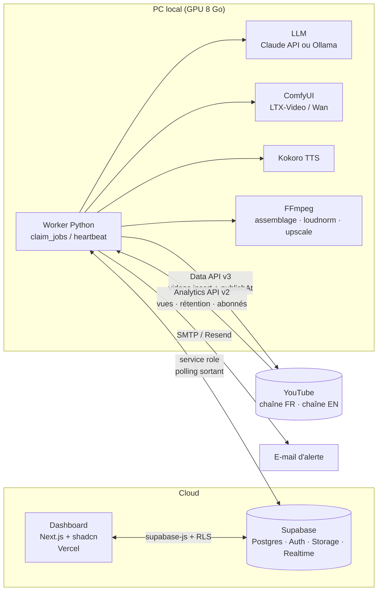
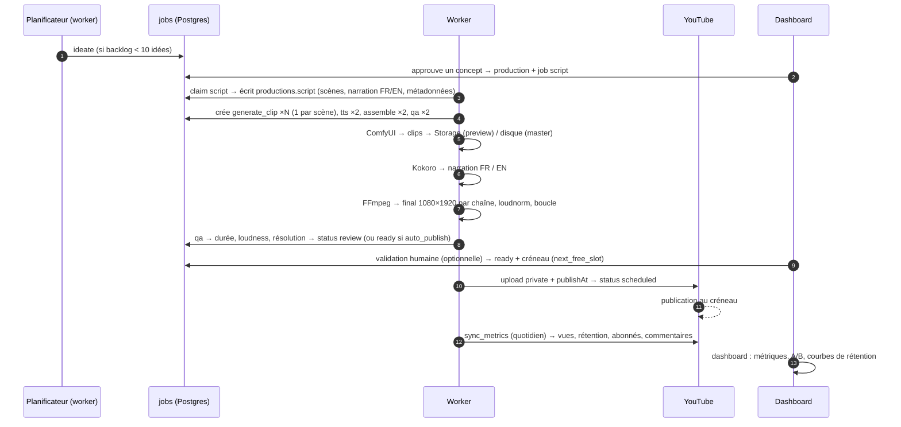

# 01 · Architecture générale

> Objectif : produire et publier automatiquement 3 Shorts / jour / chaîne (FR + EN),
> générés par IA en local, avec un dashboard pour piloter la fabrique de bout en bout.

## 1. Vue d'ensemble

Trois plans, un seul état partagé (Postgres sur Supabase) :

| Plan | Où | Rôle |
|---|---|---|
| **Dashboard** | Vercel (Next.js 16 + shadcn/ui) | Pilotage : idées, production, calendrier, métriques, réglages. Lecture/écriture via Supabase. |
| **Contrôle** | Supabase (Postgres, Auth, Storage, Realtime) | Source de vérité : file de jobs, vidéos, métriques, prompts, alertes. |
| **Fabrique** | PC de bureau (GPU 8 Go) | Worker Python : agents LLM, ComfyUI (vidéo), Kokoro (TTS), FFmpeg (montage), upload YouTube, synchro Analytics. |



Principes :

1. **Le PC ne reçoit jamais de connexion entrante.** Le worker interroge la file de jobs
   (polling sortant HTTPS) et remonte sa progression dans Postgres. Aucun port à ouvrir,
   aucun tunnel.
2. **YouTube gère la publication.** Les vidéos sont uploadées en `private` avec un `publishAt`.
   Si le PC est éteint au moment du créneau, la vidéo sort quand même. Le worker maintient
   un tampon (buffer) de 2 à 3 jours de vidéos déjà programmées.
3. **Un master visuel, deux rendus.** Une *production* génère les clips une seule fois ; une
   *vidéo* par chaîne y ajoute narration, textes et métadonnées localisés (ADR-002).
   Le coût GPU est divisé par deux.
4. **Tout passe par la file de jobs.** Chaque étape (script, clip, TTS, montage, QA, upload,
   synchro) est un job avec progression 0-100, tentatives et journal. Le dashboard s'y
   abonne en temps réel (Supabase Realtime) : c'est la vue « avancement des vidéos ».
5. **Fournisseurs interchangeables.** LLM, génération vidéo et TTS sont derrière des
   interfaces (ADR-005) : on peut A/B tester local vs cloud sans toucher au pipeline.
6. **Les fichiers lourds restent sur le PC.** Seuls un aperçu 480p et un poster montent
   dans Supabase Storage pour le dashboard ; le fichier final part directement vers YouTube.

## 2. Flux d'une vidéo (résumé)



## 3. Stack technique

**Dashboard** (`apps/dashboard`)
- Next.js 16 (App Router, Server Components), TypeScript strict, Tailwind v4.
- shadcn/ui (composants dans `src/components/ui`, `components.json` prêt pour la CLI).
- Recharts via le wrapper `chart` de shadcn ; TanStack Table pour la liste des vidéos.
- Supabase JS (`@supabase/ssr`) : auth par e-mail (liste blanche `app_users`), RLS.
- Mode `NEXT_PUBLIC_MOCK=1` : données factices déterministes pour développer sans backend.

**Contrôle** (`supabase/`)
- Postgres : schéma dans `migrations/0001_init.sql` (types, tables, vues, RLS, fonctions
  `claim_jobs`, `fail_job`, `requeue_stale_jobs`, `next_free_slot`).
- Realtime activé sur `jobs`, `videos`, `productions`, `alerts`.
- Storage : bucket privé `previews` (mp4 480p + jpg), lu par le dashboard via URL signée.
- `channel_credentials` : refresh tokens chiffrés, sans policy RLS → service role uniquement.

**Fabrique** (`services/worker`)
- Python 3.11+, `uv`, `httpx`, `supabase-py` (ou psycopg direct), `pydantic`, `apscheduler`.
- Étapes dans `worker/steps/*`, fournisseurs dans `worker/providers/*` (protocoles).
- YouTube : `google-api-python-client` (upload résumable), Analytics v2 via REST.
- Alertes : e-mail (Resend ou SMTP) sur échec définitif d'un job, quota > 80 %, créneau vide < 24 h.

## 4. Sécurité et accès

| Acteur | Clé | Portée |
|---|---|---|
| Navigateur (dashboard) | anon key + session Supabase Auth | RLS : uniquement les e-mails de `app_users` |
| Routes serveur Next.js (OAuth callback) | service role | écrit `channel_credentials` |
| Worker local | service role | tout, contourne la RLS (machine de confiance) |
| Google OAuth | client « application Web » | scopes `youtube.upload`, `youtube`, `yt-analytics.readonly` |

- Les refresh tokens sont chiffrés (AES-GCM, clé `CREDENTIALS_KEY`) avant insertion ;
  le worker les déchiffre localement.
- Aucune clé côté client ; `NEXT_PUBLIC_*` ne contient que l'URL et l'anon key.

## 5. Ce qui n'est PAS dans l'architecture (volontairement)

- **n8n** : remplacé par le worker + la file Postgres (ADR-001). Réintroduire n8n n'a de sens
  que pour des intégrations tierces (Notion, Slack…) en périphérie.
- **Automatisation d'UI web (Puppeteer sur des SaaS)** : interdit par les CGU, risque de ban.
  Uniquement des API officielles ou des modèles locaux.
- **Un service cloud toujours allumé pour la génération** : le GPU est local ; si le PC est
  éteint, la file attend et le tampon de vidéos programmées absorbe l'absence.

## 6. Arborescence du dépôt

```
youtube-2.0/
├── README.md
├── docs/                    ← ce dossier (architecture, modèle, pipeline, dashboard, API, roadmap)
│   └── decisions/           ← ADR (décisions d'architecture)
├── supabase/migrations/     ← schéma Postgres
├── apps/dashboard/          ← Next.js 16 + shadcn/ui
└── services/worker/         ← worker Python (agents, génération, upload, synchro)
```
