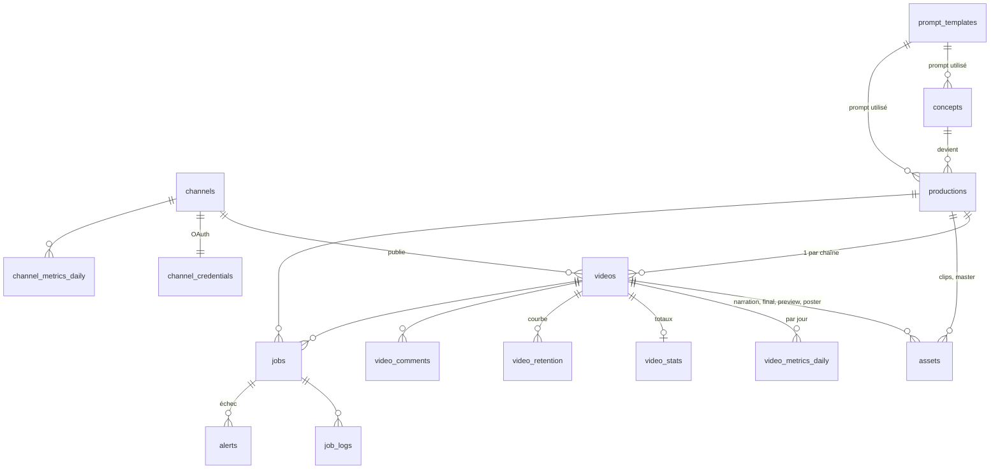

# 02 · Modèle de données

Schéma complet : [`supabase/migrations/0001_init.sql`](../supabase/migrations/0001_init.sql) ; données de départ (utilisateur autorisé, prompts v1) : [`supabase/seed.sql`](../supabase/seed.sql).
Types TypeScript miroir : `apps/dashboard/src/lib/types.ts`.



## Entités

### `channels`
Une ligne par chaîne YouTube (`fr`, `en`). Porte le fuseau, les créneaux de publication
(`publish_slots`, ex. `{09:00,13:00,18:00}`), le mode `auto_publish` (sinon validation humaine)
et le projet GCP utilisé (quota API dédié par chaîne, voir `05-youtube-api.md`).

### `concepts` → `productions` → `videos`
| Niveau | Cardinalité | Contenu | Statuts |
|---|---|---|---|
| **concept** | 1 | idée : titre, hook, catégorie, beats visuels, score | proposed → approved → used / rejected |
| **production** | 1 par concept retenu | format A/B, script (`ScriptV1`), clips, master silencieux | draft → scripting → generating → assembling → ready / failed |
| **video** | 1 par chaîne | narration, titre/description/tags localisés, final, créneau, id YouTube | pending → rendering → qa → review → ready → uploading → scheduled → published / failed |

`ScriptV1` (JSON dans `productions.script`) :
```json
{
  "version": 1,
  "scenes": [
    { "index": 0, "duration_s": 4, "visual_prompt": "…", "narration": { "fr": "…", "en": "…" },
      "on_screen_text": { "fr": "…", "en": "…" }, "sfx": "wood sliding, click" }
  ],
  "loop_note": "dernier plan = premier plan (porte fermée)",
  "metadata": { "fr": { "title": "…", "description": "…", "tags": [] }, "en": { … } }
}
```

### `jobs` (file d'attente)
Un job = une étape atomique, avec `type`, `priority`, `progress` (0-100), `progress_label`
(« Clip 5/8 »), `attempts/max_attempts`, `run_after` (backoff), `depends_on` (DAG simple),
`locked_by/locked_at` (verrou + heartbeat). Les fonctions SQL :

| Fonction | Rôle |
|---|---|
| `claim_jobs(worker, types[], max)` | réserve des jobs prêts (dépendances terminées) avec `FOR UPDATE SKIP LOCKED` |
| `fail_job(job, error)` | re-planifie avec backoff (5 min × tentative) ou passe en `failed` + alerte |
| `requeue_stale_jobs()` | requalifie les jobs `running` sans heartbeat depuis 15 min |
| `next_free_slot(channel, after)` | prochain créneau libre d'une chaîne (14 jours glissants) |

DAG type pour une production (format A, 8 scènes) :
```
script ─┬─ generate_clip[0..7] ─┬─ assemble(fr) ── qa(fr) ── upload(fr)
        ├─ tts(fr) ─────────────┤
        └─ tts(en) ─────────────┴─ assemble(en) ── qa(en) ── upload(en)
```

### `assets`
Fichiers produits : `clip` (par scène), `narration`, `music`/`sfx`, `master` (visuel
silencieux), `final` (par vidéo), `preview` (480p dans Storage), `poster` (jpg dans Storage).
`local_path` = chemin sur le PC ; `storage_path` = objet Supabase Storage.

### Métriques
| Table | Source | Fréquence |
|---|---|---|
| `video_stats` | Data API `videos.list(part=statistics)` — 1 unité / 50 vidéos | toutes les 6 h |
| `video_metrics_daily` | Analytics API `reports.query` (rapport « Top videos », une requête par jour, filtre `video==…`) | 1 fois / jour (J-3 à J) |
| `video_retention` | Analytics `audienceRetention` (`elapsedVideoTimeRatio`) | J+3 puis J+14 après publication |
| `channel_metrics_daily` | Analytics niveau chaîne + `channels.list(statistics)` | 1 fois / jour |
| `video_comments` | Data API `commentThreads.list` | 1 fois / jour, 20 derniers |
| `api_quota_usage` | comptabilité interne des unités consommées | à chaque appel |

`v_video_overview` agrège tout ça pour la liste « vidéos publiées » ; `v_production_progress`
calcule l'avancement d'une production à partir de ses jobs.

### `prompt_templates`
Prompts versionnés par agent (`idea`, `script`, `visual`, `improve`), un seul actif par agent.
La boucle d'amélioration crée une nouvelle version (`created_by = improve_agent`,
`parent_id`) ; chaque concept/production référence la version utilisée → on peut mesurer
la performance par version de prompt.

### `alerts`
Créées par `fail_job` et par le worker (quota, créneau vide, upload restreint). `emailed_at`
évite les doublons de mail ; `acknowledged_at` est posé depuis le dashboard.

## Sécurité (RLS)
- Toutes les tables : policy `is_app_user()` (e-mail présent dans `app_users`).
- `channel_credentials` : RLS activée sans policy → seul le service role (worker, routes
  serveur) y accède.
- Storage `previews` : lecture pour `app_users`, écriture via service role.

## Évolutions prévues
- `experiments` (tests A/B explicites au-delà du format) et `video_scores` (score
  composite rétention × vues × abonnés) pour l'agent d'amélioration.
- `supabase gen types typescript` pour remplacer `types.ts` écrit à la main.
