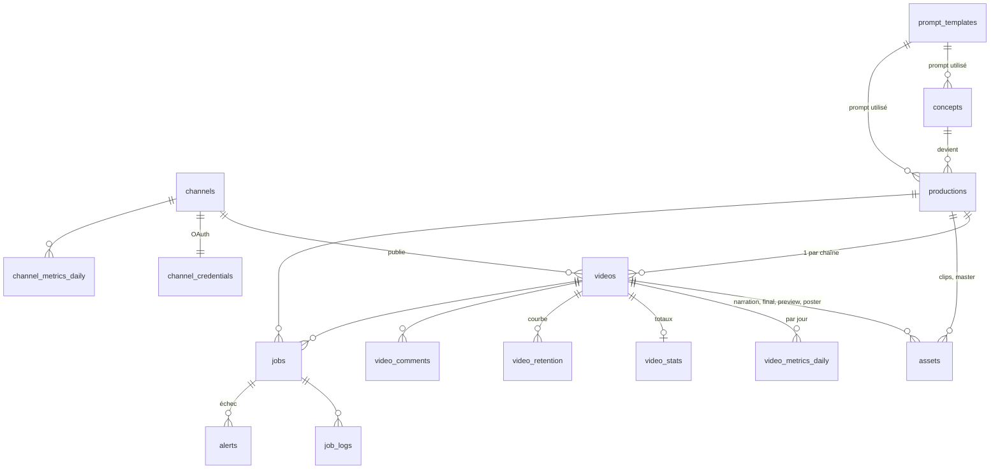

# 02 · Modèle de données

Schéma complet : [`supabase/migrations/0001_init.sql`](../supabase/migrations/0001_init.sql) ; données de départ (utilisateur autorisé, prompts v1) : [`supabase/seed.sql`](../supabase/seed.sql).
Types TypeScript miroir : `apps/dashboard/src/lib/types.ts`.



## Entités

### `channels`
Une ligne par chaîne YouTube (`fr`, `en`). Porte le fuseau, les créneaux de publication
(`publish_slots`, ex. `{09:00,13:00,18:00}`), le mode `auto_publish` (sinon validation humaine)
et le projet GCP utilisé (quota API dédié par chaîne, voir `05-youtube-api.md`).

### `concepts` → `productions` → `videos`
| Niveau | Cardinalité | Contenu | Statuts |
|---|---|---|---|
| **concept** | 1 | idée : titre, hook, catégorie, beats visuels, score | proposed → approved → used / rejected |
| **production** | 1 par concept retenu | format A/B, script (`ScriptV1`), clips, master silencieux | draft → scripting → generating → assembling → ready / failed |
| **video** | 1 par chaîne | narration, titre/description/tags localisés, final, créneau, id YouTube, publication TikTok (`tiktok`) | pending → rendering → qa → review → ready → uploading → scheduled → published / failed |

`videos.tiktok` (jsonb, migration 0024, docs/36) : état de la publication de la vidéo sur TikTok par Zernio, `null` tant
qu'elle n'est pas demandée : `status` (sending, scheduled, publishing…, published, failed, cancelled), `post_id`
(Zernio), `url`, `scheduled_for`, `published_at`, `account_id`, `username`, `error`, `round`, `draft`. Les réglages
(lien chaîne YouTube → compte TikTok, publication automatique, rattrapage `backlog`, interactions, étiquette IA) sont dans
`app_settings.tiktok`, la clé API chiffrée dans `app_secrets.zernio_api_key`. Depuis 0026 (docs/39), `videos.tiktok.source`
dit d'où vient la publication (auto, rattrapage, bibliothèque, cli, manuel).

Statistiques TikTok (migration 0026, docs/39), relevées chaque heure par le job `sync_tiktok` : `tiktok_accounts` (un
compte connecté à Zernio : abonnés, j'aime reçus, vidéos, Business ou non), `tiktok_account_snapshots` (relevés),
`tiktok_posts` (une vidéo sortie sur un compte, rattachée à `videos` si elle vient de l'appli : vues, j'aime,
commentaires, partages, enregistrements, temps regardé, part vue jusqu'au bout, provenance des vues, vues à 24 h et 7 j),
`tiktok_post_snapshots` (relevés), vue `v_tiktok_post_daily_snapshots` (dernier relevé de chaque jour). Vue
`v_tiktok_backlog` : vidéos de l'appli sorties sur YouTube et jamais envoyées sur TikTok (rattrapage).

`ScriptV1` (JSON dans `productions.script`) :
```json
{
  "version": 1,
  "scenes": [
    { "index": 0, "duration_s": 4, "visual_prompt": "…", "narration": { "fr": "…", "en": "…" },
      "on_screen_text": { "fr": "…", "en": "…" }, "sfx": "wood sliding, click" }
  ],
  "loop_note": "dernier plan = premier plan (porte fermée)",
  "metadata": { "fr": { "title": "…", "description": "…", "tags": [] }, "en": { … } }
}
```

### `jobs` (file d'attente)
Un job = une étape atomique, avec `type`, `priority`, `progress` (0-100), `progress_label`
(« Clip 5/8 »), `attempts/max_attempts`, `run_after` (backoff), `depends_on` (DAG simple),
`locked_by/locked_at` (verrou + heartbeat). Les fonctions SQL :

| Fonction | Rôle |
|---|---|
| `claim_jobs(worker, types[], max)` | réserve des jobs prêts (dépendances terminées) avec `FOR UPDATE SKIP LOCKED` ; ordre : priorité, place de la vidéo dans la file (`production_queue_key`), ancienneté ; saute les productions en pause (0027, docs/40) |
| `pause_productions(ids[], now)` / `unpause_productions(ids[])` | pause d'une vidéo (`productions.paused_at`) : « tout de suite » interrompt le calcul GPU en cours (marqueur `Mise en pause`), la reprise le remet en file sans passer devant la vidéo en cours (docs/40) |
| `reorder_queue(ids[])` / `focus_production(id, now)` | ordre de la file choisi dans le panneau Tâches (`productions.queue_at`) ; « tout mettre en pause sauf celle-ci » (docs/40) |
| `fail_job(job, error)` | re-planifie avec backoff (5 min × tentative) ou passe en `failed` + alerte |
| `requeue_stale_jobs()` | requalifie les jobs `running` sans heartbeat depuis 15 min |
| `next_free_slot(channel, after)` | prochain créneau libre d'une chaîne (14 jours glissants) |

DAG type pour une production (format A, 8 scènes) :
```
script ─┬─ generate_clip[0..7] ─┬─ assemble(fr) ── qa(fr) ── upload(fr)
        ├─ tts(fr) ─────────────┤
        └─ tts(en) ─────────────┴─ assemble(en) ── qa(en) ── upload(en)
```

### `assets`
Fichiers produits : `clip` (par scène), `narration`, `music`/`sfx`, `master` (visuel
silencieux), `final` (par vidéo), `preview` (480p dans Storage), `poster` (jpg dans Storage).
`local_path` = chemin sur le PC ; `storage_path` = objet Supabase Storage.

### Métriques
| Table | Source | Fréquence |
|---|---|---|
| `video_stats` | compteurs publics (Data API `videos.list`, 1 unité / 50 vidéos) + totaux Analytics de toute la vie de la vidéo, audience à 3 s, vues 24 h / 7 j (0016) | compteurs chaque heure, Analytics toutes les 6 h |
| `video_snapshots`, `channel_snapshots` | relevés horaires des compteurs (vues, j'aime, commentaires ; abonnés de la chaîne) ; gardés 10 jours puis un par jour (0016) | chaque heure |
| `video_metrics_daily` | Analytics API `reports.query` (rapport « Top videos », une requête par jour, filtre `video==…`) | toutes les 6 h (7 derniers jours) |
| `video_retention` | Analytics `audienceRetention` (`elapsedVideoTimeRatio`), la plus récente seulement | une par jour, vidéos de moins de 45 jours |
| `channel_metrics_daily` | Analytics niveau chaîne (le nombre d'abonnés vient de `channel_snapshots`) | toutes les 6 h (7 derniers jours) |
| `performance_reports`, `performance_lessons` | agent analyste : rapport, leçons à valider ou en service (0016, [`25-dashboard-statistiques.md`](25-dashboard-statistiques.md)) | chaque dimanche et à la demande |
| `video_comments` | Data API `commentThreads.list` | 1 fois / jour, 20 derniers |
| `api_quota_usage` | comptabilité interne des unités consommées | à chaque appel |

`v_video_overview` agrège tout ça pour la liste « vidéos publiées » ; `v_production_progress`
calcule l'avancement d'une production à partir de ses jobs.

### `prompt_templates`
Prompts versionnés par clé (`agent`) : le prompt système de chaque agent (`idea`, `script`, `script_timelapse`,
`seo`, `keyframe_qc`…) et les consignes communes (`rules_storytelling`, `guide_tour`…), une seule version active par
clé, lue par le worker à chaque appel. `created_by` : `code` (texte du code, enregistré par le worker à son démarrage),
`human` (écrite dans l'onglet Agents), `improve_agent` (proposition de la boucle d'amélioration, `parent_id`).
Chaque concept/production référence la version utilisée → on peut mesurer la performance par version de prompt.
Voir [`22-agents.md`](22-agents.md) (migration 0012 : `sync_code_prompt`, `save_prompt`, `activate_prompt`).

### `montage_templates`
Modèles de montage (onglet Montage) : `name`, `template` (JSON de `MontageTemplate`, worker/montage.py : titre
d'accroche, sous-titres, textes à l'écran, positions en px du final), `is_default` (un seul : celui que le step
`assemble` lit à chaque montage ; aucun = modèle d'origine du code). SQL `set_default_montage_template`,
`remount_video` (refaire le montage d'une vidéo pas encore envoyée). Voir [`23-montage.md`](23-montage.md)
(migrations 0013 et 0014 : type de job `montage_preview`, rendu exact).

### `alerts`
Créées par `fail_job` et par le worker (quota, créneau vide, upload restreint). `emailed_at`
évite les doublons de mail ; `acknowledged_at` est posé depuis le dashboard.

## Sécurité (RLS)
- Toutes les tables : policy `is_app_user()` (e-mail présent dans `app_users`).
- `channel_credentials` : RLS activée sans policy → seul le service role (worker, routes
  serveur) y accède.
- Storage `previews` : lecture pour `app_users`, écriture via service role.

## Évolutions prévues
- `experiments` (tests A/B explicites au-delà du format) et `video_scores` (score
  composite rétention × vues × abonnés) pour l'agent d'amélioration.
- `supabase gen types typescript` pour remplacer `types.ts` écrit à la main.
