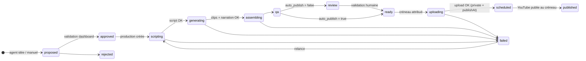

# 03 · Pipeline de production

## 1. Machine à états



Les statuts `concept`, `production` et `video` sont détaillés dans `02-data-model.md`.

## 2. Les étapes (jobs)

| Job | Cible | Entrée | Sortie | Exécutant | Durée typique (8 Go VRAM) |
|---|---|---|---|---|---|
| `ideate` | — | prompt `idea` + top 20 vidéos + catégories sous-représentées | N concepts `proposed` | LLM | 30 s |
| `script` | production | concept + prompt `script` + 5 exemples de scripts top performers | `ScriptV1` + jobs suivants | LLM | 30-60 s |
| `generate_clip` | production, `scene_index` | `visual_prompt`, style preset, durée | clip 9:16 (mp4, 480-576p) | ComfyUI | 1-8 min |
| `tts` | vidéo | `narration_text` (langue) | wav narration | Kokoro (CPU/GPU) | 10 s |
| `assemble` | vidéo | clips + narration + SFX + textes | final 1080×1920 mp4, preview 480p, poster | FFmpeg | 1-2 min |
| `qa` | vidéo | final | `qa_report` (durée, loudness, résolution, frames noires, boucle) ; `ready` si `auto_publish`, sinon `review` ; mail « vidéo terminée » (docs/32) | ffprobe / ffmpeg | 10 s |
| `upload` | vidéo | final + métadonnées + créneau | `youtube_video_id`, `scheduled` | Data API v3 | 30-90 s |
| `tiktok_publish` | vidéo | final + titre et description YouTube + créneau | `videos.tiktok` : publication TikTok programmée au même créneau, puis son lien (docs/36) | API Zernio | 30 s à 2 min, puis attente du créneau |
| `sync_metrics` | chaîne | J-2..J | `video_metrics_daily`, `video_stats`, `channel_metrics_daily` | Analytics + Data API | 30 s |
| `sync_retention` | vidéo | J+3 / J+14 | `video_retention` | Analytics API | 5 s |
| `sync_comments` | vidéo | — | `video_comments` | Data API | 5 s |
| `improve` | — | métriques 14 j par version de prompt | nouvelle version de `prompt_templates` (inactive, à valider) | LLM | 1 min |

Contrat d'un step (Python) :

```python
class Step(Protocol):
    type: JobType
    async def run(self, job: Job, ctx: Context) -> dict:  # result JSON
        ...
# ctx.progress(pct, label) → UPDATE jobs SET progress, progress_label, locked_at = now()
# ctx.log(level, message, data) → INSERT job_logs
# ctx.enqueue(type, **kwargs) → INSERT jobs (avec depends_on)
```

Le worker :
1. `claim_jobs(worker_id, types, max=1)` toutes les 5 s (jobs GPU sérialisés : concurrence 1 ;
   jobs réseau/LLM : concurrence 3).
2. Exécute le step, envoie un heartbeat (`locked_at`) toutes les 30 s.
3. `done` + `result` ou `fail_job(id, error)` (backoff, puis alerte).

## 3. Planificateur (dans le worker, APScheduler)

| Quand | Action |
|---|---|
| toutes les 20 s | envoi des mails en attente : « vidéo terminée » et mail d'essai des Réglages (docs/32) ; les autres alertes (échecs, quota, tampon) restent en base, sans mail |
| toutes les 5 min | `requeue_stale_jobs()` ; pour chaque vidéo `ready` sans créneau : `scheduled_at = next_free_slot(channel)` puis job `upload` (uniquement si créneau < 72 h : ne pas immobiliser des uploads trop tôt, le quota est journalier) |
| toutes les 5 min | `plan_tiktok` : pour chaque chaîne reliée à TikTok en publication automatique, chaque Short programmé sur YouTube depuis l'activation (et 24 h en arrière au plus) reçoit un job `tiktok_publish` (docs/36) |
| toutes les heures | si backlog de concepts `approved` + productions en cours < 3 jours de créneaux → job `ideate` (10 idées) et, si `auto_approve_ideas`, création automatique des productions |
| 03:00 | `sync_metrics` par chaîne ; `sync_retention` pour les vidéos publiées J+3 et J+14 ; `sync_comments` pour les 10 dernières |
| 06:00 | contrôle des créneaux : alerte si un créneau < 24 h est vide ; alerte si quota J-1 > 80 % |
| dimanche 04:00 | `improve` : propose une nouvelle version de prompt par agent (à valider dans `/settings`) |

Tampon visé : **≥ 6 vidéos `scheduled` par chaîne** (2 jours). Sous ce seuil, priorité des
jobs de génération abaissée (plus urgent) et alerte `warning`.

## 4. Agents (LLM)

Tous les agents sont des steps qui appellent le fournisseur LLM avec un prompt versionné
(`prompt_templates`) et une sortie JSON validée par Pydantic/Zod. Fournisseur principal
`LLM_PROVIDER` (Claude par défaut) et chaîne de secours `LLM_FALLBACKS` (Mistral, Gemini, puis
Ollama en local) : un appel qui échoue passe au suivant, un fournisseur sans clé est ignoré.

- **Idée** (`ideate`) : reçoit les 12 catégories, la répartition des 30 derniers jours, les 20
  meilleures vidéos (titre, hook, rétention) et produit 10 concepts scorés avec hook et beats
  visuels. Évite les doublons (similarité de titre sur le backlog).
- **Script** (`script`) : transforme un concept en `ScriptV1` : 6-10 scènes de 3-5 s, prompt
  visuel par scène (style preset injecté), narration FR + EN (format A) ou SFX (format B),
  textes à l'écran courts, métadonnées par langue (titre ≤ 60 car., description, tags),
  `loop_note`.
- **Analytics** : pas un LLM, une requête SQL : classement composite
  `0.5·rétention_norm + 0.3·vues_norm + 0.2·abonnés/1k_vues_norm` sur 28 jours → top 20,
  exposé au dashboard et aux agents idée/script (few-shot).
- **Amélioration** (`improve`) : compare les versions de prompt actives sur 14 jours (rétention,
  vues, abonnés), lit les hooks des meilleures/pires vidéos et propose un prompt révisé.
  Jamais activé automatiquement : validation dans `/settings` (garde-fou).

## 5. Génération vidéo (ComfyUI)

- Workflows JSON versionnés dans `services/worker/workflows/` (un par modèle : `ltx_t2v.json`,
  `wan_t2v.json`). Le step remplace les nœuds `prompt`, `seed`, `width/height`, `frames`.
- Résolution native : 576×1024 (LTX) ou 480×832 (Wan 1.3B), 24 fps, 4-5 s → upscale ×2 dans
  `assemble` (Real-ESRGAN si dispo, sinon lanczos) vers 1080×1920.
- 2 candidats par scène si le temps GPU le permet ; sélection par score simple (netteté +
  absence de frames noires) ; le dashboard permet de choisir manuellement plus tard.
- Presets de style (`productions.style_preset`) : `modern_minimal`, `warm_wood`, `night_led`…
  suffixes de prompt + négatifs communs.

## 6. Assemblage (FFmpeg)

1. Concat des clips (upscale, `fps=30`, `setsar`), fondu 6 frames entre scènes.
2. Format A : narration Kokoro alignée scène par scène (durée de scène ≥ durée audio + 0,3 s,
   sinon la scène est étirée en `minterpolate` ou le texte est raccourci par le step script).
3. Format B : lit d'ambiance + SFX par scène (bibliothèque locale libre de droits) mixés.
4. Textes à l'écran : `drawtext` avec police du preset, zone sûre Shorts (éviter le bas 20 %).
5. `loudnorm` I=-14 LUFS, TP=-1 dB ; H.264 High, CRF 18, AAC 192 k, `-movflags +faststart`.
6. Sorties : `final` (1080×1920), `preview` (480p, ~3 Mo → Storage), `poster` (frame du hook).

## 7. Contrôle qualité (`qa`)

| Test | Seuil | Échec → |
|---|---|---|
| durée | 15 s ≤ d ≤ 58 s | `failed` (re-script) |
| résolution / ratio | 1080×1920 exact | `failed` |
| loudness | -15 ≤ I ≤ -13 LUFS | re-`assemble` |
| frames noires / figées | < 0,5 s cumulées | re-`generate_clip` de la scène fautive |
| narration tronquée | fin audio < fin vidéo - 0,2 s | re-`assemble` |
| boucle | similarité première/dernière frame (facultatif, score informatif) | — |

## 8. Upload et programmation

- `videos.insert` (résumable), `snippet.title/description/tags/categoryId`,
  `status.privacyStatus=private`, `status.publishAt=<créneau ISO>`,
  `status.selfDeclaredMadeForKids=false`, `status.containsSyntheticMedia=true` si rendu réaliste.
- Après succès : `youtube_video_id`, `youtube_publish_at`, statut `scheduled`,
  `api_quota_usage += 1` (compteur d'envois à part, 100 par jour : `05-youtube-api.md` §3).
- Le lendemain, `sync_metrics` confirme `published` (privacyStatus public) et détecte un upload
  resté `private` (projet API non audité → alerte `error`, voir `05-youtube-api.md`).
- **TikTok** (docs/36) : `tiktok_publish` envoie le même fichier à Zernio (presign + PUT), crée la publication
  TikTok au même créneau (`scheduledFor`), puis se remet en file jusqu'à l'heure prévue pour confirmer la sortie et
  récupérer le lien. Zernio publie à l'heure même si le PC est éteint. Légende : titre + description YouTube, sans
  `#shorts`. Une clé d'idempotence par envoi : un job relancé ne publie jamais deux fois.

## 9. Reprise et idempotence

- Chaque step est **idempotent** : il vérifie d'abord si sa sortie existe (asset présent,
  `youtube_video_id` déjà posé) avant de recalculer.
- Un `upload` ne se relance jamais automatiquement au-delà de 2 tentatives (risque de doublon
  sur YouTube) : la 3e passe par le dashboard.
- Un job `failed` peut être relancé depuis `/production` (remise en `queued`, `attempts = 0`).
