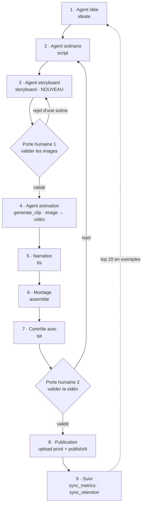

# 09 · Agents et automatisation — révision

> Révision du 2026-09-20, à partir de la cible réelle : Shorts de 25-35 s, 3 par jour,
> stock d'une semaine, validation humaine au départ puis automatisation progressive.
> Complète `03-pipeline.md`, qu'elle corrige sur trois points.

## 1. La chaîne d'agents

Toutes les étapes sont écrites dans `services/worker/worker/steps/`, y compris le storyboard et sa
porte humaine depuis le 2026-09-21, ainsi que les agents SEO et stratégie : voir
`11-sous-titres-seo-strategie-storyboard.md`.

## 2. Les trois corrections

### 2.1 Passer par l'image avant la vidéo

C'est la correction la plus importante, et elle sert trois objectifs à la fois.

Aujourd'hui `generate_clip.py` envoie le prompt de la scène directement à un modèle
texte-vers-vidéo (`{workflow}_t2v.json`). Sur un GPU de 8 Go, c'est le chemin le plus lent et le
moins contrôlable. La route image puis animation, recommandée par `08-benchmark-video.md` mais
jamais câblée, donne :

| | Texte → vidéo | Image → vidéo |
|---|---|---|
| Temps par scène | 4 à 6 min | environ 2,5 min |
| Nuit de calcul (18 scènes) | 1 h 30 à 2 h | 45 min |
| Qualité des matières et de la lumière | moyenne | nettement meilleure |
| Correction possible avant dépense GPU | aucune | oui, sur l'image |

Le troisième point est le vrai gain. Relire six images prend dix secondes et ne coûte rien. Relire
une vidéo finie coûte une nuit de calcul. **La première porte humaine doit donc porter sur le
storyboard, pas sur la vidéo.**

Concrètement : un nouveau step `storyboard` génère deux à quatre images verticales par scène avec
Z-Image Turbo, retient la meilleure, et attend votre accord. `generate_clip` anime ensuite l'image
validée avec Wan 2.2 I2V plutôt que de repartir du texte.

### 2.2 Moins de scènes, plus longues

`03-pipeline.md` prévoit 6 à 10 scènes de 3 à 5 s. La cible réelle est 25-35 s en plans de 5 s,
soit **six scènes**. Le modèle `ScriptV1` accepte déjà de 4 à 14 scènes, seul le prompt de l'agent
scénario est à reprendre.

Une précision utile : les modèles locaux produisent nativement 3 à 5 s. Un plan de 10 s demande de
doubler les images par seconde générées, donc la VRAM et le temps. Restez à 5 s par plan.

### 2.3 Programmer à sept jours

Le planificateur retarde l'envoi vers YouTube jusqu'à 72 h avant le créneau
(`scheduler.py:40`). Programmer loin ne coûte pourtant aucun quota supplémentaire. Trois réglages
à changer pour tenir un stock d'une semaine :

| Réglage | Aujourd'hui | Cible |
|---|---|---|
| Avance d'envoi (`scheduler.py:40`) | 72 heures | 168 heures |
| Tampon visé par chaîne | 6 vidéos | 21 vidéos |
| Seuil de relance de l'idéation | moins de 3 jours de créneaux | moins de 7 jours |

## 3. L'agent idée : thèmes enrichis

Les douze catégories de départ, complétées par vos apports. À maintenir dans le prompt `idea`
de la table `prompt_templates`.

**Intérieur caché** : passages secrets, escaliers à tiroirs, cave sous escalier, cinéma escamotable,
mobilier motorisé, mur pivotant, rangement plafond.
**Extérieur et terrain** : piscine, container dans le jardin, container enterré, abri de jardin
transformé, cabane dans les arbres, aménagement paysager, toit-terrasse.
**Pièces et usages** : home gym dans le garage, pod bureau, salle de bain zen, buanderie cachée,
mur en tasseaux à LED.
**Chantier et matière** : rénovation avant-après, béton et époxy, immeuble et surélévation,
construction souterraine.

Trois règles qui font la différence sur ce format : la révélation arrive avant la douzième seconde,
un événement visuel toutes les trois à quatre secondes, et le dernier plan reboucle sur le premier.

## 4. L'heure de publication

`channels.publish_slots` contient aujourd'hui trois heures fixes. C'est le bon point de départ :
personne ne connaît encore l'audience de la chaîne. Après trois à quatre semaines,
`sync_metrics` aura de quoi calculer les heures réelles de pointe, et les créneaux pourront être
recalculés chaque semaine. Ne pas optimiser avant d'avoir des données.

## 5. Par où commencer

L'objectif du premier jalon n'est pas l'automatisation, c'est **une seule vidéo publiée de bout en
bout**. Tout le reste en découle.

1. Démarrer la pile locale et appliquer le schéma, puis écrire la couche de lecture du dashboard
   (`apps/dashboard/src/lib/data/supabase.ts`, dix fonctions vides aujourd'hui). Sans elle, rien
   n'est observable.
2. Installer ComfyUI et les deux modèles, lancer le banc d'essai `scripts/bench_video.py` pour
   fixer `VIDEO_PROVIDER` sur des mesures réelles et non sur des estimations.
3. Faire tourner une production à la main, scène par scène, en mode `DRY_RUN` d'abord. C'est là que
   les vrais problèmes apparaissent.
4. Écrire le step `storyboard` et la porte humaine sur les images.
5. Connecter la chaîne YouTube et publier une vidéo de test en non répertorié.
6. Seulement ensuite, laisser le planificateur enchaîner, une vidéo après l'autre.

Gardez `auto_publish = false` tant que dix vidéos ne sont pas sorties sans correction de votre part.
