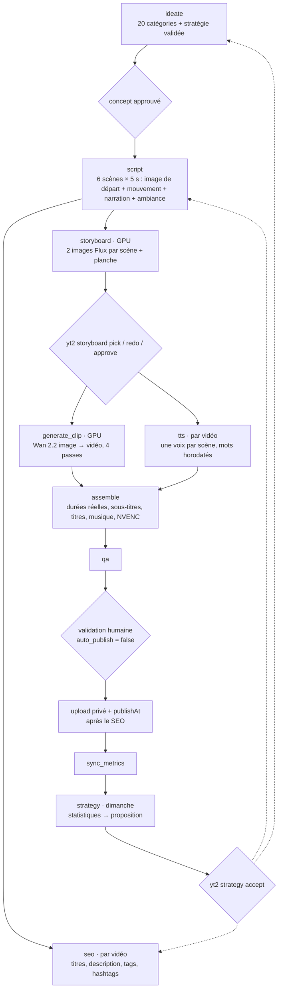

# 11 · Sous-titres, agents SEO et stratégie, storyboard (OpenMontage)

> Livré le 2026-09-21. Met en œuvre la révision de `09-agents-et-automatisation.md` et trois
> demandes de Luca : reprendre OpenMontage, ajouter des agents titres / description / mots-clés avec
> ajustement de la stratégie d'après les statistiques, et reprendre la structure d'un générateur de
> Shorts en étapes (captures dans `Pictures/__YouTube-Automation`), notamment les sous-titres
> personnalisables. Migration : `supabase/migrations/0002_subtitles_seo_strategy_storyboard.sql`.

## 1. Le pipeline après cette livraison



Les trois portes humaines (`G1`, `G2`, `G3`) restent actives au démarrage. Pour automatiser plus
tard : `STORYBOARD_REVIEW=0`, `channels.auto_publish = true`. La stratégie reste toujours validée à la main.

## 2. Sous-titres personnalisables

Reprend les réglages de l'écran « Customize Subtitles » des captures et le karaoké de MJClipIt
(`worker/subtitles.py`). Rendu par un fichier ASS gravé par FFmpeg (libass), vérifié à l'image.

| Réglage de la capture | Champ du profil |
|---|---|
| Font family, font size, boldness | `font_family`, `font_size` (px sur 1080×1920), `bold` |
| Text color, outline color, outline width | `text_color`, `outline_color`, `outline_width` |
| Color subtitles | `highlight_mode` : `none`, `word` (mot prononcé coloré), `karaoke` (remplissage) + `highlight_color` |
| Drop shadow, shadow blur, shadow angle | `shadow_opacity`, `shadow_distance`, `shadow_blur`, `shadow_angle` (couche d'ombre séparée, orientable et floutée) |
| Letter spacing, text transform | `letter_spacing`, `text_transform` |
| Position, background | `position` (+ `offset_y`), `background` : `none` ou `box` (une seule boîte par légende) |
| Animation | `animation` : `none`, `pop`, `bounce`, `fade`, `slide_up` |
| Saved subtitle profiles | table `subtitle_profiles` + 5 profils intégrés |
| (en plus) | `max_words`, `max_chars` (deux lignes au plus), titres de scène `title_*` |

Profils intégrés : `impact` (défaut : Montserrat, capitales, mot actif jaune, pop), `karaoke`,
`sobre` (fond sombre), `affiche` (Bebas Neue géant), `bd` (Luckiest Guy). Polices libres fournies
dans `services/worker/assets/fonts/`.

```
uv run yt2 subtitles list
uv run yt2 subtitles preview --profile affiche            # vidéo d'essai dans %TEMP%\yt2_apercu
uv run yt2 subtitles preview --file mon_profil.json --voice   # avec la vraie voix Kokoro
uv run yt2 subtitles save mon_profil --file mon_profil.json
```
Profil d'une chaîne : `channels.subtitle_profile` ; surcharge par vidéo : `videos.subtitle_profile`.

**Minutage des mots.** La narration est désormais synthétisée scène par scène (`worker/timeline.py`) :
chaque voix est posée au début de sa scène, les silences sont retirés, et les mots sont répartis
proportionnellement à leur longueur avec des pauses après la ponctuation (précision d'environ
0,15 s sur une voix de synthèse). Une scène dont la phrase déborde est allongée ; le montage ralentit
alors le clip (au plus × 1,35) puis tient la dernière image. Résultat stocké dans `videos.timeline`.

## 3. Voix et musique (écran « Voice » des captures)

- Vitesse de la voix : `channels.voice_speed` (0,70 à 1,50 ; défaut 1,05). La hauteur de voix n'existe
  pas dans Kokoro : non reprise.
- Musique par ambiance : l'agent script choisit `music_mood` (epic, calm, suspense, upbeat, emotional,
  mysterious). Le montage prend une piste dans `DATA_DIR/music/<ambiance>/` (repli `default/`), la
  boucle, l'atténue automatiquement sous la voix (ducking) et la fait disparaître en fin de vidéo.
  Volume : `channels.music_volume` (défaut 0,12). Déposer des musiques libres de droits (YouTube
  Audio Library, Pixabay Music) dans ces dossiers.
- Non repris des captures : la carte Reddit et le fond « gameplay », propres à ce format.

## 4. Storyboard et workflows d'OpenMontage

`VIDEO_PROVIDER=comfy_wan22_i2v_4step` active la route image → vidéo :
1. `storyboard` (GPU) génère `STORYBOARD_CANDIDATES` images 9:16 par scène avec Flux.1 schnell, la
   première est retenue, une planche PNG (une ligne par scène, image retenue cadrée en vert) est écrite
   dans `DATA_DIR/productions/<id>/storyboard/planche.png`, et une alerte demande la validation.
2. Validation :
   ```
   uv run yt2 storyboard show <production>          # liste + planche
   uv run yt2 storyboard pick <production> 2:1      # scène 2 → image 1
   uv run yt2 storyboard redo <production> 4        # nouvelles images pour la scène 4
   uv run yt2 storyboard approve <production>       # lance clips, voix, montage
   ```
3. `generate_clip` anime l'image retenue avec le `motion_prompt` de la scène ; une scène sans image
   retenue repasse en texte → vidéo (`wan22_t2v_4step`).

Ce qui vient d'OpenMontage (AGPL-3.0, idées reprises, code réécrit) : la recette Wan 2.2 14B à deux
experts (bruit fort puis faible) en 4 passes avec la LoRA lightx2v, le client ComfyUI (envoi d'image,
erreurs de nœuds, sorties `images`/`videos`), et la vérification des modèles. Corrigé : son texte →
vidéo produit 81 images indépendantes. Adapté : GGUF pour 8 Go, 480×832, 5 s au plus par clip.
Modèles à télécharger et dossiers : `services/worker/workflows/README.md`. Le banc d'essai
`scripts/bench_video.py` mesure désormais image puis animation.

## 5. Agent SEO

`seo`, une fois par vidéo, dès le script écrit (rien ne part sur YouTube avant qu'il ait fini) :
- reçoit la vraie narration, les textes à l'écran, l'accroche, les titres qui marchent sur la chaîne
  (vues à J+7), les 30 derniers titres à ne pas répéter et la stratégie validée ;
- propose 3 à 5 titres avec des leviers différents, une description, 10 à 15 tags, 3 hashtags et un
  commentaire à épingler, dans la langue de la chaîne ;
- les règles de YouTube sont appliquées en code : `<` et `>` interdits, titre ≤ 70 caractères (sinon
  une autre variante, sinon coupure à un mot), hashtags ajoutés en fin de description, description
  ≤ 5 000 octets, tags ≤ 500 caractères en comptant les guillemets des tags à espaces.
Les variantes restent dans `videos.seo` pour un test A/B manuel dans YouTube Studio.
`uv run yt2 seo redo <vidéo>` réécrit les métadonnées.

## 6. Agent stratégie

`strategy`, chaque dimanche à 04:30 et pour chaque chaîne active :
1. le code calcule, sur 28 jours et pour les vidéos d'au moins 3 jours, les ventilations par catégorie,
   format, durée, créneau, heure et caractéristiques du titre : médiane des vues à J+7, écart à la
   médiane de la chaîne, rétention, abonnés pour 1 000 vues, engagement, et une confiance
   (faible < 3 vidéos, moyenne < 8, bonne au-delà) ;
2. sous 6 vidéos, rien n'est proposé (données insuffisantes) ; sinon le LLM interprète ces chiffres
   et propose : poids des catégories, consignes d'accroche, modèles de titres, à éviter, créneaux,
   durée cible, expériences ;
3. garde-fous en code : créneaux au format HH:MM, même nombre qu'aujourd'hui et justifiés par une
   heure de confiance au moins moyenne ; poids plafonné à 2 sauf confiance bonne ;
4. validation :
   ```
   uv run yt2 strategy show fr
   uv run yt2 strategy accept fr 3      # applique la v3 (et les créneaux proposés)
   uv run yt2 strategy reject fr 3
   uv run yt2 strategy run fr           # calculer tout de suite
   ```
Une stratégie acceptée guide l'agent idée (poids, accroches), l'agent script (accroches, durée) et
l'agent SEO (modèles de titres). Pas de taux de clic : dans le flux Shorts, il n'y a pas de miniature
cliquée. Inspiré de youtube-automation-agent (MIT), dont l'étude a montré des statistiques simulées
et des créneaux tirés au hasard : ici tout chiffre vient de la base.

## 7. Base de données (migration 0002) et données de départ

- Types de jobs `seo`, `strategy`, `storyboard` ; assets `storyboard`, `subtitles` ; statut de
  production `storyboard_review` ; prompts versionnés `seo` et `strategy`.
- Tables `subtitle_profiles` et `strategies` (une seule active par chaîne), vue `v_video_performance`.
- Colonnes `channels.subtitle_profile`, `voice_speed`, `music_volume` ; `videos.seo`, `timeline`,
  `subtitle_profile` ; `assets.selected`.
- `seed.sql` : prompts idée et script alignés sur les nouveaux agents ; chaîne FR en validation
  humaine (`auto_publish = false`) ; chaîne EN inactive tant qu'elle n'existe pas sur YouTube.

## 8. À savoir sous Windows

L'accès contrôlé aux dossiers de Windows Defender est actif sur ce PC : il bloque l'écriture dans
Documents, Images et Vidéos pour tout programme non autorisé (uv, Python, bash, la CLI Supabase…).
Le code reste dans le dépôt, mais tout ce qui s'écrit vit dans `C:\YouTube2`, dossier non protégé du
disque interne (le 2026-09-21 au soir : d'abord installé sur D:, puis rapatrié, D: étant un disque externe
branché à l'occasion ; C: doit être libéré d'environ 60 Go pour ComfyUI et ses modèles) :

| Dossier | Contenu | Réglé par |
|---|---|---|
| `C:\YouTube2\worker-venv` | environnement Python du worker | `UV_PROJECT_ENVIRONMENT` dans le lanceur |
| `C:\YouTube2\data` | clips, voix, montages, storyboards, `music\<ambiance>\`, cache Wikipédia | `DATA_DIR` dans `services/worker/.env` |
| `C:\YouTube2\models` | modèles Kokoro (`kokoro-v1.0.onnx`, `voices-v1.0.bin`) | `KOKORO_MODEL_PATH`, `KOKORO_VOICES_PATH` |
| `C:\YouTube2\supabase-workdir` | copie de `supabase/` lue par la CLI Supabase | le lanceur la resynchronise et applique les migrations à chaque démarrage |
| `C:\YouTube2\bench` | sorties du banc d'essai vidéo | option `--out` de `scripts/bench_video.py` |
| `C:\ComfyUI_windows_portable` | ComfyUI et ses modèles (environ 60 Go) | détecté par le lanceur (sinon `C:\YouTube2\…`, sinon `Downloads`) ; s'il tourne déjà sur le port 8188, réutilisé |

Le lanceur (`launcher/youtube-shorts-daily - demarrer.bat`, copie identique sur le Bureau) :
démarre Docker Desktop si besoin, puis Supabase local (`npx supabase --workdir C:\YouTube2\supabase-workdir
start` ; au premier démarrage, migrations et `seed.sql` appliqués), crée l'environnement Python,
lance ComfyUI s'il existe, le worker, et le dashboard, ou réutilise celui qui tourne déjà sur le
port 3000. Diagnostic sans rien lancer : ajouter `/check`. Une nouvelle migration ajoutée plus tard
s'applique avec `npx supabase --workdir C:\YouTube2\supabase-workdir migration up`, après avoir
relancé le lanceur (qui recopie `supabase/`).

Les fichiers `.bat` doivent rester en fins de ligne CRLF (`.gitattributes`) : avec des fins de
ligne Unix, `cmd.exe` retrouve mal les étiquettes `goto` et `call`.

## 9. Reste à faire

- Écrans du dashboard pour ces trois validations et pour l'éditeur de profil avec aperçu en direct
  (la commande `yt2` en tient lieu) ; la couche de lecture du dashboard est toujours à écrire.
- Alignement Whisper des mots, plus précis que la répartition proportionnelle.
- Premier essai réel : ComfyUI, modèles, banc d'essai, puis une production de bout en bout.
- Planificateur : avance d'envoi 72 h → 168 h pour le stock d'une semaine (`scheduler.py`, voir `09` §2.3).
