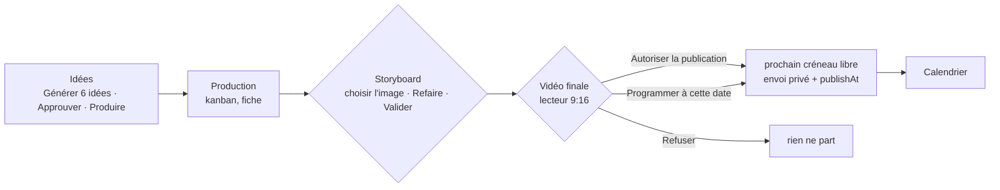

# 13 · Dashboard branché : réglages IA, démarrer, voir, programmer

> Livré le 2026-09-22, à la suite de trois demandes de Luca : plus rien sur D: (disque externe), la clé Gemini
> et le choix des modèles réglables depuis le dashboard, et le flux complet démarrer une production → voir le
> résultat → programmer sur YouTube depuis le dashboard, « comme sur MJClipIt ».
> Migration : `0004_settings_secrets_actions.sql`. Le dashboard lit désormais la vraie base (`NEXT_PUBLIC_MOCK=0`).

## 1. Le flux, écran par écran

| Écran | Ce qu'il fait maintenant | Comment |
|---|---|---|
| **Idées** | liste réelle par état, série et faits sourcés ; **Générer 6 idées** pour la série choisie ; **Approuver / Rejeter** ; **Produire** (crée la production et met le script en file) | actions serveur `app/ideas/actions.ts` → table `concepts`, job `ideate`, fonction SQL `create_production` |
| **Production** | kanban à 7 colonnes (Script, Storyboard à valider, Clips, Assemblage, Vidéo à autoriser, Prête / programmée, Échec), rafraîchi toutes les 5 s ; fiche avec **storyboard** (images cliquables, Refaire, Valider), **lecteur vidéo** de la vidéo finale, script scène par scène avec les rôles et les problèmes de storytelling, jobs, **Relancer** | `app/production/actions.ts` ; images et vidéos servies par `GET /api/media/<asset>` (fichier lu sur le disque, requêtes partielles pour la balise vidéo, chemin jamais pris dans l'URL) |
| **Autoriser la publication** | prend le prochain créneau libre de la chaîne, met la vidéo en `ready`, crée le job `upload` (envoi privé + `publishAt`), affiche « programmée le … » | fonction SQL `approve_video` (même logique que le planificateur) |
| **Programmer à cette date** | même chose à une date choisie (30 min minimum) | fonction SQL `schedule_video` |
| **Refuser** | annule l'envoi, marque la vidéo refusée avec le motif | fonction SQL `reject_video` |
| **Réglages → Intelligence artificielle** | clés Gemini / Claude / Mistral (chiffrées, jamais renvoyées), fournisseur principal, secours, **modèle** par fournisseur : liste proposée + **Ajouter un modèle** + **Charger la liste depuis Google** + **Tester** | `app/settings/actions.ts` → `app_settings` (clé `llm`), `app_secrets` |
| **Réglages** | connexion YouTube (retour de Google affiché), publication automatique par chaîne (vraie), prompts en base, quota du jour | |
| **Calendrier, Vue d'ensemble, Vidéos, Expériences, Alertes** | données réelles (vides tant que rien n'est publié) | `src/lib/data/supabase.ts` |

Le storyboard des scènes en continuité (qui repartent du clip précédent, docs/12 §4) n'a pas d'image : la fiche
le dit. « Valider le storyboard » met en file un job `render` ; le worker construit le graphe de rendu avec le
plan de continuité (`steps/render.py`).

## 2. Réglages IA : où ils vivent, qui les lit

- `app_settings` (clé `llm`) : `{provider, fallbacks, models: {gemini: "gemini-3.8-flash", …}, custom_models: {…}}`.
- `app_secrets` : `gemini_api_key`, `anthropic_api_key`, `mistral_api_key`, chiffrés en AES-GCM avec
  `CREDENTIALS_KEY` (la même clé dans `apps/dashboard/.env.local` et `services/worker/.env`, même format que les
  jetons YouTube). RLS sans policy : seule la clé service role lit la table. Le dashboard n'affiche que les
  4 derniers caractères.
- Le worker (`worker/settings_store.py`) relit ces réglages à chaque appel de LLM (cache de 30 s) et ils
  **priment sur le .env**, qui reste le repli. `yt2 settings show` montre la configuration effective.
- Liste des modèles Gemini proposés (vérifiée sur ai.google.dev le 2026-09-21) : 3.8-flash, 3.7-flash, 3.6-flash,
  3.5-flash, 3.5-flash-lite, 3.1-pro-preview, 3.1-flash-lite, 3-flash-preview, 2.5-flash, 2.5-flash-lite, 2.5-pro.
  « Charger la liste depuis Google » interroge `models.list` avec votre clé et n'ajoute que les modèles texte.
  Le champ libre accepte n'importe quel identifiant.
- Même chose en ligne de commande : `yt2 settings key gemini <clé>`, `yt2 settings llm --provider gemini --model …`,
  `yt2 settings test`.

## 3. Ce qui a changé sous le capot

- **Plus de D:** : tout vit dans `C:\YouTube2` (venv, données, modèles, copie Supabase, bancs d'essai) ; lanceur,
  `.env`, docs et script de téléchargement mis à jour. Le lanceur applique aussi les nouvelles migrations à chaque
  démarrage et réutilise un ComfyUI déjà lancé.
- **Fonctions SQL** partagées entre dashboard et `yt2` : `create_production`, `approve_video`, `schedule_video`,
  `reject_video` ; vues `v_concept_overview`, `v_production_overview` ; job `render`.
- **Couche de lecture** `src/lib/data/supabase.ts` (les dix fonctions du contrat + `listSeries`), clé service
  role côté serveur uniquement (`DASHBOARD_AUTH=none`, usage local sur le PC : pas de connexion, pas de RLS).
- **Heure réelle** : les pages utilisaient une date figée de démo (`NOW`) ; `now()` rend l'heure vraie hors démo.
- **Types** : `storyboard_review`, jobs `seo`, `strategy`, `storyboard`, `render`, séries, storyboard, rôles de scène.
- Correction : le cookie OAuth YouTube était `secure`, donc jamais posé sur `http://localhost` ; il ne l'est plus
  qu'en production.

## 4. Mise en route

1. Relancer le lanceur (le worker charge le code au démarrage ; le dashboard recharge tout seul).
2. Réglages → Intelligence artificielle : coller la clé Gemini, **Enregistrer**, choisir le modèle, **Tester**,
   **Enregistrer les réglages**.
3. Idées → choisir une série → **Générer 6 idées** → approuver → la production démarre toute seule (15 min au
   plus, ou **Produire** tout de suite).
4. Production → la carte passe en « Storyboard à valider » → choisir les images → **Valider** → clips, voix,
   montage → « Vidéo à autoriser » → regarder → **Autoriser la publication** (ou une date) → Calendrier.
5. Réglages → **Connecter YouTube** avant le premier envoi (l'upload échoue sinon, la vidéo reste prête).

Toujours manquant pour une vidéo finale : les voix Kokoro (`scripts/download_models.ps1 -SkipWan -SkipZImage`)
et, pour la qualité, les modèles 14B + Z-Image une fois la place faite sur C: (docs/12 §5).

## 5. Reste à faire

- Journal des jobs en direct (Supabase Realtime) à la place du rafraîchissement toutes les 5 s.
- Éditeur de prompts et de profils de sous-titres dans Réglages ; poids et briefs des séries dans le dashboard.
- Un vrai « première + dernière image » pour la boucle finale (Wan 14B).
- Variante « tendances » de l'agent idée (docs/10 §6).
